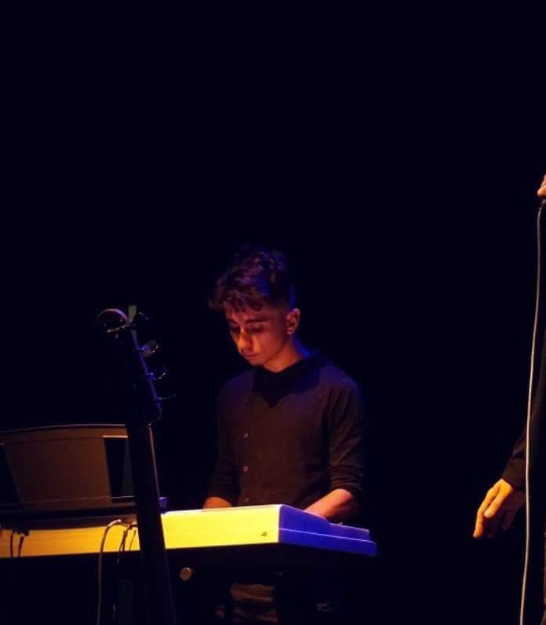

# Presentación

## Estudiante: Luciano Alejo Rodriguez

## Bio: Buenas, soy Lucho y tengo 19 años. Me encanta programar pero ademas soy un apasionado por la música, toco el piano y la guitarra hace varios años.

 

Seguí los pasos del doc [acá](https://docs.google.com/document/d/e/2PACX-1vQkogtG88cmwEIXEuff291urSyrZUYHikLIoRTspUodvIg5OoaUJTi8n0vqPJ3XUSN65sqJALTBizeB/pub).
